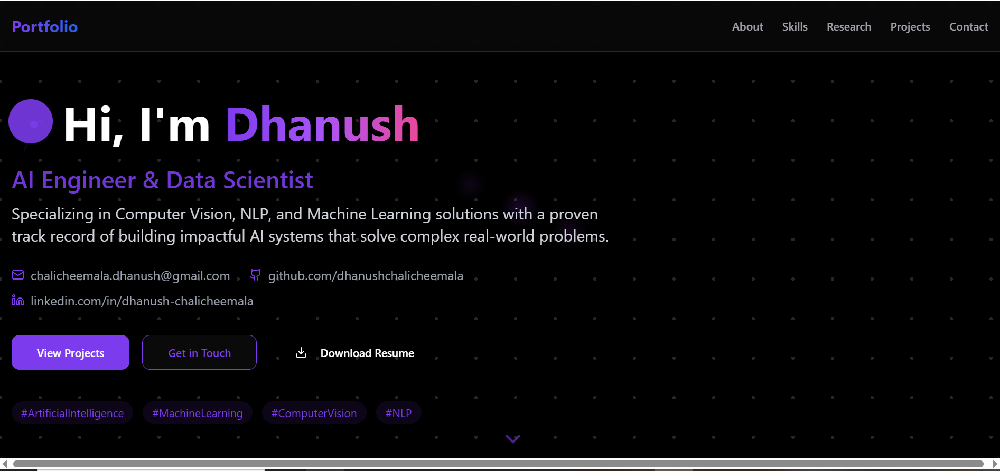

# Personal Portfolio Website

A modern, responsive personal portfolio website showcasing skills, projects, research, and professional experience. Built with React, TypeScript, and Tailwind CSS for a sleek, animated user experience.



## 📋 About This Portfolio

This portfolio website serves as a comprehensive digital resume and project showcase for Dhanush Chalicheemala, an AI Engineer and Data Scientist. The site features a modern, dark-themed design with animated elements that create an engaging user experience.

### Key Highlights:

- **Interactive UI**: Animated elements powered by Framer Motion create dynamic visual effects including neural network nodes, floating particles, and smooth transitions between sections
- **AI/ML Focus**: Showcases specialized skills in Computer Vision, NLP, and Machine Learning with detailed project descriptions
- **Research Publications**: Presents academic research papers complete with publication details, impact factors, and DOI links
- **Professional Experience**: Timeline of work history highlighting key achievements and responsibilities
- **Skills Visualization**: Visual representation of technical proficiency across programming languages, frameworks, and tools

The site is built using modern web technologies focusing on performance and responsive design, ensuring a smooth experience across all devices from mobile to desktop.

## 🚀 Features

- **Modern UI/UX**: Sleek design with animations and responsive layout
- **Project Showcase**: Display your projects with descriptions, technologies, and links
- **Skills Section**: Visual representation of technical skills with progress indicators
- **Research Publications**: Showcase academic publications and research work
- **Professional Experience**: Timeline of work history and achievements
- **Contact Form**: Allow visitors to get in touch with you
- **Dark Mode**: Optimized for dark mode viewing
- **Responsive Design**: Looks great on all devices (mobile, tablet, desktop)

## 🛠️ Technologies Used

- **Frontend**:
  - React.js
  - TypeScript
  - Tailwind CSS
  - Framer Motion (animations)
  - Lucide React (icons)
  - Shadcn UI Components

- **Backend**:
  - Node.js
  - Express.js

## 📋 Prerequisites

- Node.js (v14 or later)
- npm or yarn

## 🔧 Installation & Setup

1. Clone the repository:
   ```bash
   git clone https://github.com/dhanushchalicheemala/portfolio.git
   cd portfolio
   ```

2. Install dependencies:
   ```bash
   npm install
   # or
   yarn install
   ```

3. Start the development server:
   ```bash
   npm run dev
   # or
   yarn dev
   ```

4. Open your browser and navigate to:
   ```
   http://localhost:3000
   ```

## 📁 Project Structure

```
/
├── client/                # Frontend code
│   ├── src/
│   │   ├── components/    # UI components
│   │   ├── pages/         # Page components
│   │   ├── styles/        # Global styles
│   │   ├── types/         # TypeScript type definitions
│   │   └── App.tsx        # Main application component
│   ├── public/            # Static assets
│   └── index.html         # HTML entry point
├── server/                # Backend code
│   └── index.ts           # Express server
├── shared/                # Shared code between client and server
└── package.json           # Project dependencies and scripts
```

## 🚢 Deployment

This portfolio can be deployed to various platforms:

1. **Vercel or Netlify**: Connect your GitHub repository for automatic deployments
2. **GitHub Pages**: Deploy using GitHub Actions
3. **Custom VPS**: Deploy to your own server

## 💡 Customization

To customize this portfolio for your own use:

1. Update personal information in `client/src/data/` files
2. Replace project images in `client/public/`
3. Modify the color scheme in the Tailwind configuration
4. Add your own sections as needed

## 📄 License

This project is licensed under the MIT License - see the [LICENSE](LICENSE) file for details.

## 📬 Contact

Feel free to reach out if you have any questions or feedback!

- Email: chalicheemala.dhanush@gmail.com
- LinkedIn: [linkedin.com/in/dhanush-chalicheemala](https://www.linkedin.com/in/dhanush-chalicheemala/)
- GitHub: [github.com/dhanushchalicheemala](https://github.com/dhanushchalicheemala)

---

Made with ❤️ by Dhanush Chalicheemala 